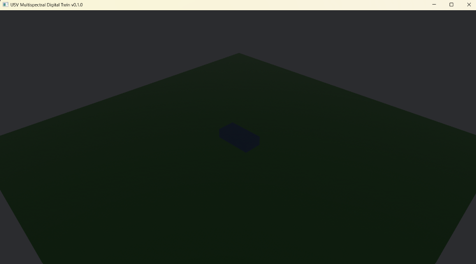

# Real-Time Digital Twin Prototype for USV Multispectral Camouflage Systems

## Project Vision
A modular real-time digital twin framework for simulating environmental interaction 
and visual signature behavior of Unmanned Surface Vehicles (USVs). This project focuses on building a real-time simulation environment to model multispectral camouflage responses under dynamic environmental conditions. Multispectral modeling is planned for future implementation and is not yet included.

## Current Demo 

  The Current Prototype Demonstrates:

- Real-time 3D simulation environment
- USV placeholder entity (vehicle model)
- Environmental surface representation (sea plane)
- Camera and lighting system
- Modular simulation architecture

The demo currently shows a static USV entity in a 3D environment with camera and lighting systems initialized. No physics or control system is yet implemented.
This represents the **initial functional simulation skeleton** 
for future multispectral modeling.

## Technical Framework & Implementation
To ensure maximum reliability and real-time performance, the project is architected with the following technologies:

* **Rust:** Chosen for its **memory safety** and high-performance computational efficiency, ensuring the simulation is robust enough for critical defense applications.
* **Bevy Engine:** Utilized as the primary **3D simulation environment**, providing a high-fidelity workspace to model physical interactions.
* **Rerun:** Employed for **real-time data visualization and logging**, allowing for the monitoring of live sensor streams and performance metrics.

## Architecture 
src
* main.rs          # Application entry point
* constants.rs     # Physical and simulation constants
* environment.rs   # Environmental state modeling
* vehicle.rs       # USV entity creation
* scene.rs         # Scene setup (camera, light, sea)
* models.rs        # Future sensor and optical models

## Theoretical Foundation & References
The core algorithms and optical models within this digital twin are grounded in rigorous electro-optical engineering principles. Key references used for system analysis, sensor modeling, and testing include:

* **Michael C. Dudzik** – *Electro-Optical Systems Design, Analysis, and Testing*
* **Cornelius J. Willers** – *Electro-Optical System Analysis and Design*
* **Sherman Karp** – *Fundamentals of Electro-Optics Systems Design*
* **William D. Rogatto** – *Electro-Optical Components*
* **George W. Masters** – *Electro-Optical Systems Test and Evaluation*

These references guide the future of implementation of sensor and optical response models.

## Project Status
Stage: Erly Prototype / Simulation Skeleton
Completed:
- [x] Core project architecture
- [x] Modular simulation structure
- [x] 3D scene initialization
- [x] Vehicle placeholder entity
- [x] Camera and lighting system

In progress:
- [ ] Dynamic vehicle motion
- [ ] Envrionment-driven response logic
- [ ] Sensor simulation layer

Planned:
- [ ] Multispectral material modeling
- [ ] Infrared Response Simulation
- [ ] Thermal behaviour modeling
- [ ] Real-time environmental adaptation 
