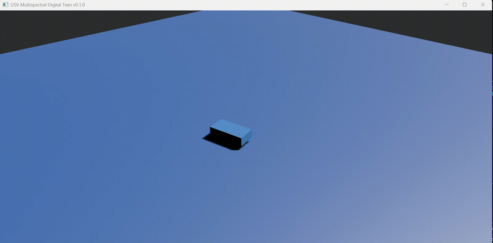

# Real-Time Digital Twin Framework for USV Multispectral Camouflage Systems

## Project Vision
A high-performance, modular digital twin framework developed in Rust for simulating environmental interaction, 6-DOF seakeeping hydrodynamics, and dynamic signature behavior of Unmanned Surface Vehicles (USVs). The platform bridges theoretical photonics, fluid dynamics, and tactical autonomy on edge-computing hardware.

## Current Demo 

### Core Capabilities
* **Adaptive Signature Management:** Closed-loop pipeline sampling environmental turbidity and water optics to dynamically modulate hull material properties in real time.
* **6-DOF Seakeeping Dynamics:** Deterministic Cummins-style rigid body solver modeling surge, sway, heave, roll, pitch, and yaw with SNAME-compliant added mass tensors and coupled viscous damping.
* **Discretized Hull Buoyancy:** 8-point volumetric hull discretization computing localized Archimedean buoyancy, surface normal pressure interactions, and transverse metacentric righting stability.
* **Analytical Gerstner Wave Synthesis:** Multi-layered trochoidal wave displacement engine exporting exact CPU-side surface elevations and spatial derivatives for zero-lag physics coupling.
* **Photonic Ocean Shading:** Physics-based ocean rendering applying the Beer-Lambert extinction law and Fresnel reflectance profiles via custom WGSL shaders.
* **Autonomous Decision & Regulatory Logic:** Deterministic state machine executing bio-inspired evasion tactics alongside COLREG (Rules 14, 15, 16) collision avoidance protocols.

---

## Technical Framework & Stack

| Layer | Technology | Architectural Role |
| :--- | :--- | :--- |
| **Core Engine** | Rust | Memory safety, zero-cost abstractions, data-driven systems. |
| **Architecture** | Bevy (ECS) | High-throughput entity parallelization and deterministic schedule. |
| **Networking** | Reqwest & Tokio | Non-blocking asynchronous I/O runtime for edge telemetry streams. |
| **Serialization**| Serde & JSON | High-efficiency structured payload encoding/decoding. |
| **Graphics** | WebGPU / WGSL | Hardware-accelerated procedural wave synthesis and light attenuation. |
| **Interface** | bevy_egui | Immediate-mode GUI for dynamic oceanographic parameter tuning. |

---

## System Architecture

src/
├── main.rs            # Engine lifecycle, state orchestration, and deterministic schedule.
├── hydrodynamics.rs   # 6-DOF Cummins equations of motion & SNAME damping solver.
├── vehicle.rs         # RigidBody6DOF state, hull cell layout, and thruster controls.
├── environment.rs     # Analytical Gerstner wave displacement and normal batch sampler.
├── constants.rs       # Hydrodynamic added mass derivatives and oceanographic constants.
├── biomimicry.rs      # Cephalopod evasion state machine and COLREGs decision logic.
├── optics/            # Vectorized Snell's law, Fresnel reflectance, and Beer-Lambert modules.
├── bridge.rs          # Hardware telemetry ingress interface and sensor bridge.
├── telemetry.rs       # Non-blocking async network streaming pipeline.
├── scene.rs           # Environment mesh generation and atmospheric fog synchronization.
└── ui.rs              # Real-time operational command center interface.

## Theoretical Foundation & References
The core algorithms and optical models within this digital twin are grounded in rigorous electro-optical engineering principles. Key references used for system analysis, sensor modeling, and testing include:

* **Michael C. Dudzik** – *Electro-Optical Systems Design, Analysis, and Testing*
* **Cornelius J. Willers** – *Electro-Optical System Analysis and Design*
* **Sherman Karp** – *Fundamentals of Electro-Optics Systems Design*
* **William D. Rogatto** – *Electro-Optical Components*
* **George W. Masters** – *Electro-Optical Systems Test and Evaluation*
* **Roger T. Hanlon and John B. Messenger** - *Cephalopod Behaviour*

These references guide the future of implementation of sensor and optical response models.

## ## Project Status
**Stage:** Active Technical Prototype / Real-Time Simulation Framework

### 🏆 Completed 

- [x] **Asynchronous Telemetry Pipeline & Network Architecture Integration**
  - Implemented a non-blocking I/O network framework using reqwest and serde. Core data structures (UsvTelemetryData) and async ingress/egress functions are fully compiled, setting up the foundation for upcoming real-time data streaming and bio-mimicry processing.

- [x] **Autonomous Environmental Perception Layer**
  - Prototyped an autonomous perception matrix that dynamically synchronizes the USV’s optical signature with real-time ocean turbidity and spectral data, proving the feasibility of adaptive stealth logic in maritime digital twins.

- [x] **Gerstner Wave Synthesis & Physics Sync**
  - Implemented a multi-layered Gerstner displacement model with 1:1 CPU-GPU synchronization, enabling the USV to realistically align its pitch and roll with procedural wave slopes.

- [x] **Photonic Ocean Rendering (Beer-Lambert Law)**
  - Integrated a physics-based Beer-Lambert light attenuation model where turbidity acts as an extinction coefficient, dynamically calculating spectral shifts and visibility ranges.

- [x] **Adaptive Surface Detail & Foam Dynamics**
  - Developed a procedural foam system and triple-layered normal map noise to simulate high-frequency sea surface turbulence and crest-dependent foam generation.

- [x] **Coupled Atmospherics**
  - Synchronized volumetric fog density with maritime turbidity levels to create a cohesive and strategically consistent environmental simulation.

- [x] **Hydrodynamics Module & Laminar Flow Analysis**
  - Integrated a hydrodynamics layer to track laminar flow stability. The system distinguishes between laminar and turbulent flow regimes, laying the analytical foundation for how surface disturbances affect the autonomous stealth signature of the USV.

- [x] **Bio-Inspired Adaptive Escape Dynamics** 
  - *Implementation:* Developed and fully compiled a deterministic, low-latency tactical state machine (`EvasionMode`) and component matrix (`ThreatVector`, `OctopodEvasionMatrix`) within the Bevy ECS architecture. The framework is engineered to consume real-time asynchronous telemetry data, enabling independent, localized micro-maneuvers and reactive hydroelastic evasion profiles against simulated hostile assets.  

- [x] **Tactical Navigation & Regulatory Autonomy (COLREG Integration)**
  - *COLREG Rule 14 Compliance (Head-on Situation):* Implemented automated reciprocal approach detection utilizing 3D vector dot-product geometry, forcing the USV to execute a deterministic course alteration to starboard (right).
  - *COLREG Rule 15 & 16 Compliance (Crossing Situation):* Integrated a real-time give-way kinematics solver that identifies crossing threats from the starboard vector and dynamically computes an avoidance path clear astern of the target vessel.

- [x] **6-DOF Hydrodynamics & Seakeeping Dynamics Engine**
  - Upgraded the vessel physics from single-point kinematics to a deterministic 6-DOF Cummins-style rigid body solver utilizing an 8-point volumetric hull discretization for localized Archimedean buoyancy, analytical wave surface normal sampling, metacentric transverse righting moments, and SNAME-compliant virtual mass and coupled linear/quadratic damping in a fixed-step simulation loop. 

### 🚧 In Progress

- [ ] **Full Multispectral Camouflage & Perception Engine**
  - *Current Focus:* Refining a granular wavelength-dependent absorption and reflection model. This will simulate active Non-Line-of-Sight (NLOS) and Near-Infrared (NIR/SWIR) signatures for advanced USV stealth testing against multi-band radar/optical sensors.

- [ ] **Adaptive Wake & Splash Simulation (Bevy Particle System)**
  - *Current Focus:* Developing a high-performance particle-based systemwithin Bevy ECS to render visual water displacement effects, hull friction trails, and spray diagnostics behind the USV as it traverses procedural high-amplitude waves.

- [ ] **Sensor Fusion Layer (Ray-Casting LiDAR/Radar)**
  - *Current Focus:* Implementing parallelized ray-casting and wave-scattering algorithms within the Bevy ECS architecture to simulate physical autonomous navigation sensors, enabling true distance detection and spatial awareness against dynamic wave surfaces.

- [ ] **Dynamic Day/Night Solar Tracking**
  - *Current Focus:* Integrating an automated solar-tracking matrix to calculate time-of-day dependent atmospheric light scattering and its direct degradation vectors on the USV’s optical sensor suite.

### 🎯 Long-Term Planned Objectives

- [ ] **Infrared (IR) & Active Thermal Signature Simulation**
  - *Objective:* Simulating thermodynamic dissipation profiles across the USV's hull. Integrating high-fidelity Long-Wave Infrared (LWIR) and Mid-Wave Infrared (MWIR) sensor feedback loops to test advanced multi-spectral camouflage efficacy against airborne thermal surveillance assets.

## Credits & Acknowledgments

Water Normal Map: Derived from the Three.js core examples (water shader). This high-frequency normal map is used to enhance surface micro-turbulence and light reflection.

## Get in Touch

I am actively developing this framework and open to technical discussions, feedback, or potential collaboration opportunities. Feel free to reach out if you have questions about the implementation:

📧 Email:muserreftpz@gmail.com